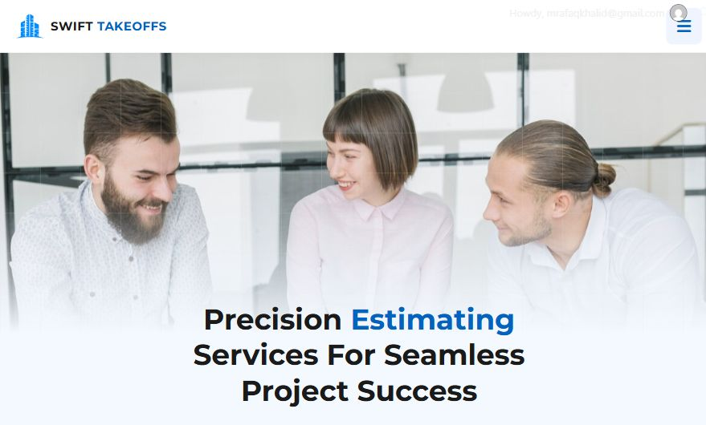

# Swift Takeoffs

Custom WordPress theme for the Swift Takeoffs construction estimating and material takeoff website.

**Live website:** [swifttakeoffs.com](https://swifttakeoffs.com/)

## Website features

- Construction estimating services and trade pages
- Responsive layouts, landing pages, blog, and FAQs
- Quote and contact forms with reCAPTCHA integration
- Custom PHP templates, CSS, JavaScript, and visual assets

## Repository contents

`theme-source.zip` and `theme-assets-*.zip` contain a copy of the custom WordPress theme (version 1.1.2), exported on October 6, 2026. Original theme author and license information are preserved in `theme/style.css`.

This repository showcases the website and theme source. It is not a complete WordPress database backup or a standalone static website. WordPress core, plugins, production configuration, customer submissions, and database records are excluded.

## Local setup

Use a separate local WordPress installation. Extract all theme ZIP archives into the same local folder to reconstruct `theme/`. Copy `theme/` into `wp-content/themes/swift-takeoffs/`. Review the theme README for its content and plugin setup. Provide your own reCAPTCHA keys through WordPress configuration; production key fallback values were removed from this exported copy.

The live site continues to run on its existing hosting. This repository has no deployment workflow or connection to production.

## Credits and licensing

Original theme author: Afaq Khalid / Nexflow Technologies, as declared in the theme header. The theme declares GNU GPL v2 or later. Third-party brands and assets remain subject to their respective rights.
